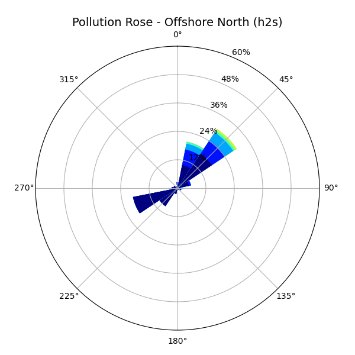

# Pollution Rose (Pollrose) Diagrams

[](https://www.gnu.org/licenses/gpl-3.0)


This repository contains a Python-based script and server implementation for generating **Pollution Rose Diagrams**, inspired by the California Air Resources Board's tool: [https://ww2.arb.ca.gov/capp/cst/rdi/wind-rose-and-pollution-rose-diagrams](https://ww2.arb.ca.gov/capp/cst/rdi/wind-rose-and-pollution-rose-diagrams)

The project utilizes pollutant concentration, wind speed, and wind direction data to visualize pollution patterns in a rose plot format. The script and its enhancements are based on the original work by Dr. Zuber Farooqui.

---

## About the Script

This Python-based solution builds on the original standalone pollution rose script created by:

**Zuber Farooqui, Ph.D.**\
Email: Zuber.farooqui [at] arb.ca.gov

### Original Documentation Highlights (as of 9/8/2020):

- The script generates both **wind rose** and **pollution rose** plots using pollutant, wind speed, and wind direction data.
- Built using open-source Python libraries: `matplotlib`, `pandas`, `numpy`, `argparse`, etc.
- Excludes calm winds (wind speed = 0) from the rose plot visualizations.
- Updated package name: `pyWRPRPlots_09082020`
- Sample data format must include headers like:

```csv
name,date,ws,wd,pm25
San Pablo,4/8/2016 0:00,3.2,215.5,9
San Pablo,4/8/2016 1:00,2.1,213.89999,11
San Pablo,4/8/2016 2:00,1.6,198.7,13
```

## Repository Structure

```
pollrose/
├── backend/            # FastAPI backend server and script interface
├── data/               # Example CSV files with air quality data
├── figures/            # Generated rose plots
├── scripts/            # Original and modified Python scripts
├── run_server.sh       # Bash script to launch the FastAPI server
├── requirements.txt    # Python dependencies
└── README.md
```

---

## Features

- Accepts user-uploaded `.csv` files through a FastAPI endpoint
- Automatically generates pollution rose figures
- Deletes temporary data and figures after a delay
- Filters out calm wind data
- Dynamically supports different pollutants such as `pm25`, `o3`, `h2s`, etc.

---

## Getting Started

1. **Install dependencies**

   ```bash
   pip install -r requirements.txt
   ```

2. **Start the FastAPI server**

   ```bash
   bash run_server.sh
   ```

3. **API Usage** POST a `.csv` file containing at least the following fields:

   - `name`
   - `date`
   - `ws` (wind speed)
   - `wd` (wind direction)
   - `pollutant` (e.g., `pm25`, `h2s`, etc.)

   Example endpoint:

   ```http
   POST https://your-deployment-url.com/generate-pollrose/
   ```

   Response:

   ```json
   {
     "message": "Pollrose generated successfully!",
     "image": "figures/PRose_SiteName_Date_Pollutant.png"
   }
   ```

<p align="center">  </P>

---

## References

- [https://matplotlib.org/gallery/pie_and_polar_charts/polar_bar.html](https://matplotlib.org/gallery/pie_and_polar_charts/polar_bar.html)
- [https://pypi.org/project/PseudoNetCDF/](https://pypi.org/project/PseudoNetCDF/)
- [https://windrose.readthedocs.io/en/latest/index.html](https://windrose.readthedocs.io/en/latest/index.html)
- [https://pandas.pydata.org/](https://pandas.pydata.org/)
- [https://numpy.org/](https://numpy.org/)
- [https://docs.python.org/3/library/argparse.html](https://docs.python.org/3/library/argparse.html)

---

## Acknowledgements

This work builds on the foundations laid by Dr. Zuber Farooqui and the California Air Resources Board. We acknowledge their effort in making air quality analysis tools accessible to the public.

---

## License

This project uses only open-source components and is provided for academic and public environmental monitoring purposes.

For any question: Zuber Farooqui, Ph.D., Zuber.farooqui [at] arb.ca.gov

Updates: 6/2/2020
The script creates wind rose (WR) and pollution rose (PR) plots using pollutant, wind speed, and wind direction data. It is a Python based script using and its libraries. Both Python, a programing language, and its libraries are open source and publicly available to download, install, and use under appropriate licenses.

This script is tailored, standalone to fulfill the need of the specific work. The script uses concepts, semantics, and logics from the listed references. The author wants to give credit to PseudNetCDF for its windrose program. The script uses its concept and modified appropriately to fulfill the objectives.

It is advised to verify the plots developed using this script with existing data and plots.

Updates: 9/8/2020

1. Both PR and WR scripts are updated to exclude calm winds. Calm winds defined as wind speed equals to zero. Calm winds are not considered to develop the WR and PR plots. Previously, calm winds were considered.
2. Pollutant concentrations associated with calm winds are again not considered to develop PR plots. Previously it was otherwise.
3. Typographical errors and bugs are eliminated.
4. Name of the entire package is changed to pyWRPRPlots_09082020: Python based Wind rose and Pollution rose Plotting suit.
5. New sample data are included in the suit with examples, jobs script, and plots.
6. Input data (below for demonstration only) format .csv files must include (shown in bold):

name,date,ws,wd,pm25
San Pablo,4/8/2016 0:00,3.2,215.5,9
San Pablo,4/8/2016 1:00,2.1,213.89999,11
San Pablo,4/8/2016 2:00,1.6,198.7,13

Or
name,date,ws,wd,o3
San Pablo,4/8/2016 0:00,3.2,215.5,40
San Pablo,4/8/2016 1:00,2.1,213.89999,11
San Pablo,4/8/2016 2:00,1.6,198.7,130

Contents:

1. Python script: This script generates pollution rose plots ‘pollrose_mpl_09082020.py’.
   This script generates wind rose plots ‘windrose_mpl_09082020.py’
2. Job script:
   a. ‘pollrose_mpl_09082020.job’, this file runs the Python code ‘pollrose_mpl_09082020.py’ with user inputs.
   b. ‘windrose_mpl_09082020.job’, this file runs the Python code ‘windrose_mpl_09082020.py’ with user inputs.
3. Sample data files for PR and WR (only for demonstration purpose):
   a. January_Data.csv
   b. April_Data.csv
4. Sample plots: a. PRose_Jan_1-15-2016_1-16-2016.png
   b. PRose_Apr_1-15-2016_1-16-2016.png
   c. WRose_Jan_1-15-2016_1-16-2016.png
   d. WRose_Apr_1-15-2016_1-16-2016.png

References
(Last Accessed: 5/11/2020)

1. Matplotlib: https://matplotlib.org/gallery/pie_and_polar_charts/polar_bar.html?highlight=polar%20charts
2. PseudoNeCDF: https://pypi.org/project/PseudoNetCDF/
3. Windrose: https://windrose.readthedocs.io/en/latest/index.html
4. Pandas: https://pandas.pydata.org/
5. Numpy: https://numpy.org/
6. argparse: https://docs.python.org/3/library/argparse.html
